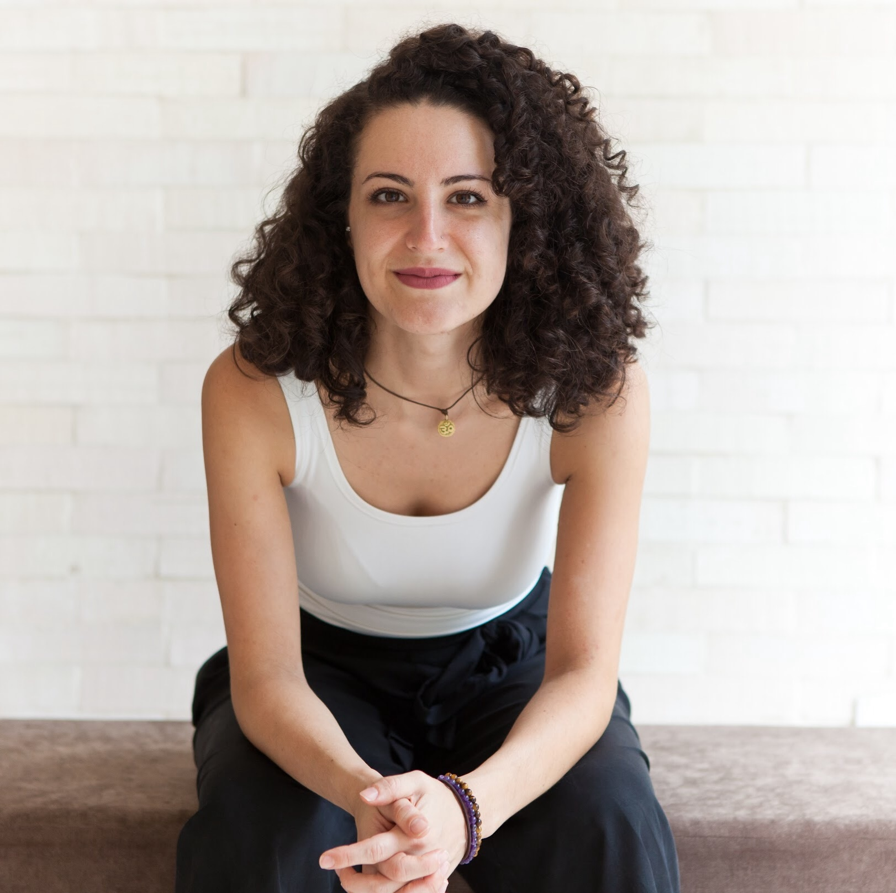

# Programa de Data Science da Compass UOL

 

## Sobre Mim

Olá! Meu nome é Bárbara Robles, e me sinto muito grata pela oportunidade de participar do programa de Data Science da _**Compass**_.

## Minha Bagagem

Sou advogada, empreendedora e tradutora de documentos jurídicos. Sou uma pessoa extremamente curiosa e gosto de profundidade. Escolhi o Direito, porque queria fazer diferença no mundo. No entanto, como amante de exatas, sempre senti que faltava algo...  ano passado, comecei a estudar programação e me encontrei! Finalmente encontrei uma área que me permite unir o meu lado humanas com o de exatas. 

Comecei a estudar programação em 2023, com a École 42 de SP, onde fiquei um mês estudando linguagem C, 24/7. Logo em seguida, mergulhei em front-end, assunto que estudava até começar o programa da Compass. Meus estudos, em grande parte, foram por conta própria, usando Udemy,  YouTube e sites por ai. Um dos projetos de que mais me orgulho, ainda que muito iniciante, é o meu chatbot, que montei do zero usando JavaScript e está neste GitHub, [aqui]((https://github.com/BaRobles/yogabot)).

Como uma pessoa muito curiosa, já tive muitos hobbies, muitos mesmo. Gosto de achar padrões nas coisas e poder traduzir isso para outras pessoas me encanta. Já estudei mais de um instrumento musical (amo quando encontro trechos semelhantes em músicas diferentes), amo idiomas, gosto de me movimentar (estou há dois anos tentando conquistar a parada de mão!) e pratico muito Yôga pra segurar a vontade que eu tenho de que o meu dia tivesse 72h!

Estou animada com a oportunidade de contribuir para a Compass e aproveitar ao máximo essa experiência incrível!
